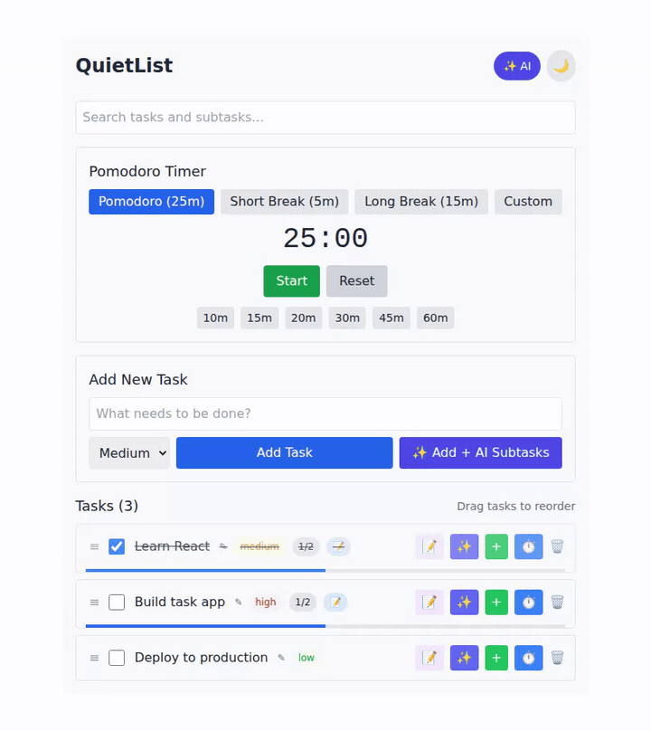

# ✨ QuietList

**The to-do list that keeps quiet — no account, no cloud.** A fast, privacy-first task
manager that runs entirely in your browser. Your tasks live in your own `localStorage`,
not on someone else's server.

It also has an **opt-in AI mode**: bring your own key (or use a local model) and turn any
goal into a checklist of subtasks with one click.

**[▶ Live demo](https://quietlist.vercel.app)** · Built with Next.js 14 + React + Tailwind.



---

## Why people like it

- 🔒 **Zero backend, zero account** — works fully offline, data never leaves your device
- ✨ **AI subtask breakdown** — type a goal, get actionable subtasks (opt-in)
- 🧩 **Tasks + subtasks** with priorities, search, and Markdown notes
- 🍅 **Built-in Pomodoro timer** — focus a session on any task
- 🖱️ **Drag-and-drop** reordering (mouse + touch)
- 🌙 **Dark mode**

## ✨ AI mode (optional)

Everything works with no setup. When you want AI, open **⚙️ AI** in the header and pick a
provider. Your key is stored **only in your browser** and sent straight to the provider —
never to any server we run.

| Provider | Key needed | Notes |
|----------|:----------:|-------|
| **Claude** (Anthropic) | yes | best subtask quality |
| **GPT** (OpenAI) | yes | most people already have a key |
| **Gemini** (Google) | yes | generous free tier |
| **Groq** | yes | free and very fast |
| **Ollama** | no | runs fully local & private (`ollama serve`) |
| **Codex CLI** | no | uses your local Codex login (local copy only) |

Two ways to use it:
- **✨ Add + AI Subtasks** — type a goal, it creates the task *and* fills in subtasks
- **✨** on any task — break an existing task into subtasks

> The `Ollama` and `Codex CLI` options are **local-only** — they use software on your own
> machine, so they won't work on a public cloud deploy (use a BYOK provider there).

## Quick start

```bash
npm install
npm run dev
# open http://localhost:3000
```

> On some Windows/WSL setups, run `node node_modules/next/dist/bin/next dev` instead of the
> npm script.

## Deploy

Push to GitHub and import the repo at [vercel.com/new](https://vercel.com/new) — no config
needed. The core app and BYOK AI providers work out of the box.

## How it works

- The UI is a single React component plus an AI settings drawer.
- AI calls go through one stateless Next.js route (`/api/ai/breakdown`) that proxies to the
  chosen provider so the browser avoids CORS. **It stores nothing** — your key is passed
  per-request and immediately forgotten.
- Tasks, settings, and theme persist in `localStorage`.

## Privacy

No analytics. No accounts. No server-side storage. Your API key and your tasks stay in your
browser; the only outbound calls are the AI requests you trigger, sent to the provider you
chose.

## License

MIT — see [LICENSE](LICENSE).
